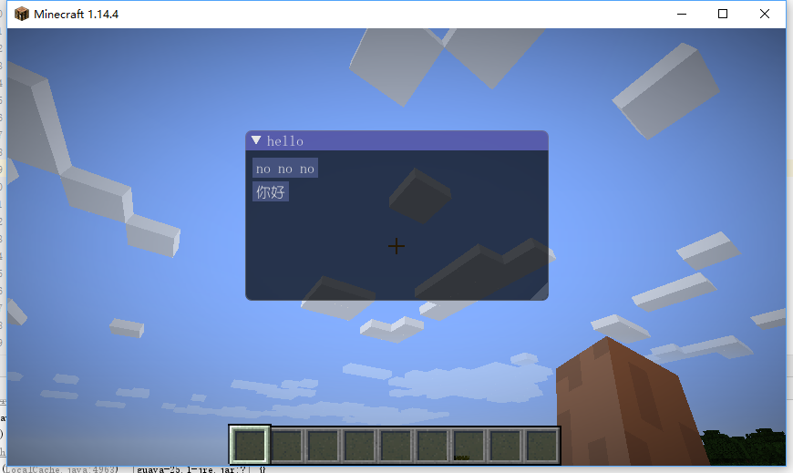
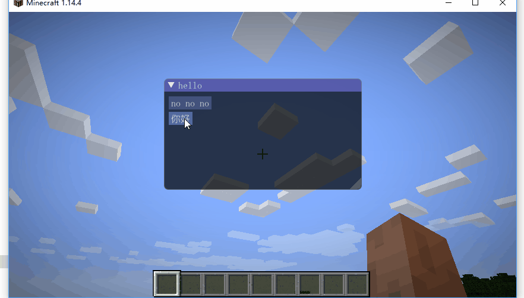

# ImGui
use imgui in mc with forge.

## I use:
- mc-version:1.14.4
- forge-version:1.14.4-28.0.13
- java and kotlin
- idea

## show

## tips:
- use kotlin write gui function,if you use java,it may cause crash.I do not know why.
- do not use the kotlin class to make a screen,it may crash.please call the kotlin function in you java class.I do not know why.
- if you do not load fonts it may cause crash.in this project I load the font SIMYOU.

## something others
- my English is terrible.
- my code is also terrible.
- if you have any question you can send email to me, or open a issue.I am glad to help you.